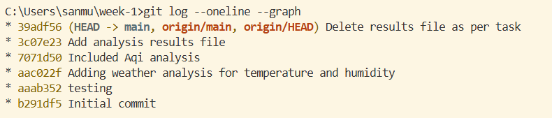
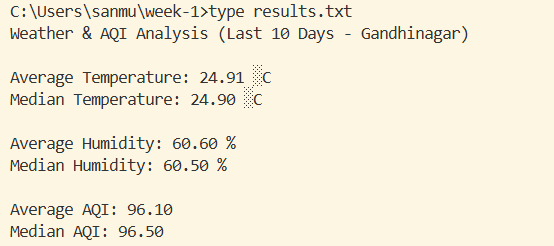

# 🌦️ Week 1 Practice – Weather & AQI Analysis

---

## 📁 Repository

🔗 **GitHub Repository:**  
https://github.com/ShanmukYadav/week-1

---

## 🧾 Snapshot of Commit History

📸 Git commit log demonstrating CRUD operations:



---

## 🧮 Analysis Objective

This project performs basic statistical analysis (**Average & Median**) on:

- 🌡️ **Temperature (°C)**
- 💧 **Humidity (%)**
- 🌫️ **AQI (Air Quality Index)**

using Python.

---

## 📊 Program Output

📸 Results generated from the Python script:



---

## 🐍 Python Implementation

```python
import statistics

temperatures = [24.5, 25.1, 26.0, 23.9, 24.8, 25.6, 26.2, 24.3, 23.7, 25.0]
humidity = [58, 60, 55, 65, 62, 59, 57, 63, 66, 61]
aqi = [82, 90, 76, 110, 105, 95, 88, 102, 115, 98]

avg_temp = statistics.mean(temperatures)
median_temp = statistics.median(temperatures)

avg_humidity = statistics.mean(humidity)
median_humidity = statistics.median(humidity)

avg_aqi = statistics.mean(aqi)
median_aqi = statistics.median(aqi)

with open("results.txt", "w") as f:
    f.write("Weather & AQI Analysis (Last 10 Days - Gandhinagar)\n\n")
    f.write(f"Average Temperature: {avg_temp:.2f} °C\n")
    f.write(f"Median Temperature: {median_temp:.2f} °C\n\n")
    f.write(f"Average Humidity: {avg_humidity:.2f} %\n")
    f.write(f"Median Humidity: {median_humidity:.2f} %\n\n")
    f.write(f"Average AQI: {avg_aqi:.2f}\n")
    f.write(f"Median AQI: {median_aqi:.2f}\n")

print("Analysis complete. Results saved to results.txt")
